# Workflow Diagrams — fpl-intelligence

Visual companion to [workflow-map.md](workflow-map.md). That document is the source of
truth; every node and edge here traces to an import, call, or artifact recorded there.
Where the map marks something UNVERIFIED it is drawn dotted and suffixed `?`.

> **Amended 2026-08-16.** Commit `ae90398` deleted `serve/scoring/`, `serve/reporting/`,
> `outputs/registry/`, `domain/registry/{verdict,governance_lookup,governance_types}.py` and the
> `model/governance/{SIGNAL_REGISTRY.md,evaluation_metadata.yaml,generate_*.py,verdict_records.py}`
> set. **Diagrams G and H below depict deleted code** and are kept only as a record of the
> pre-sweep tree; several nodes in D are likewise gone (noted per diagram). A–F are unaffected.

## Legend

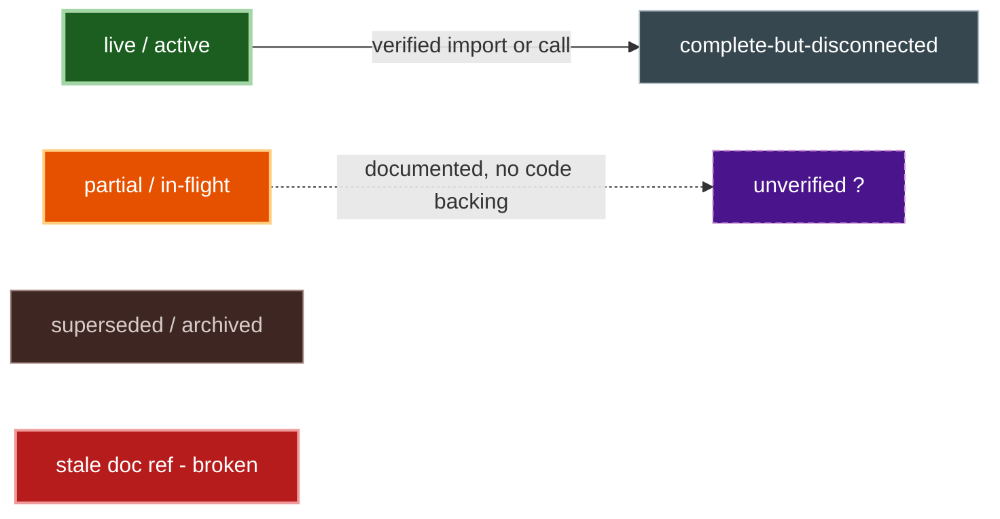

| Convention | Meaning |
|---|---|
| Solid edge | Verified import or call, read in code |
| Dotted edge | Documented but unverified, or doc-claimed with no code backing |
| `?` suffix | Covered by workflow-map §5 UNVERIFIED |
| Red node | Stale doc reference from workflow-map §4 |

---

## 1. Master divergence diagram

All eight workflows and only the edges verified between them.

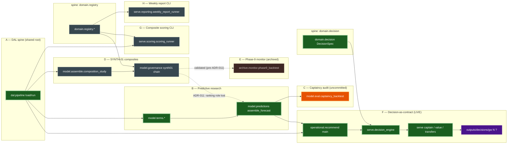

| Structural fact | How it reads in the diagram |
|---|---|
| A is the shared root | `dal.pipeline` fans out to B, D, F, G with no inbound edge |
| ADR-011 fork | Dotted `gov -.-> fc` labelled "ranking role lost"; D's solid edges now terminate inside D/E/G |
| ADR-012 fork | F is the only subgraph reaching `outputs/decisions`; it has no inbound edge from D |
| Two spines, no bridge | `domain.registry` feeds D/G/H only; `domain.decision` feeds F only; no edge joins the boxes |
| Live path | Green, thick-stroked chain `dal → fc → rec → eng → specs` |
| H has no DAL edge | `weekly_report_runner` imports `domain.registry`, never `dal.pipeline` |

---

## 2. Per-workflow diagrams

### A — DAL spine

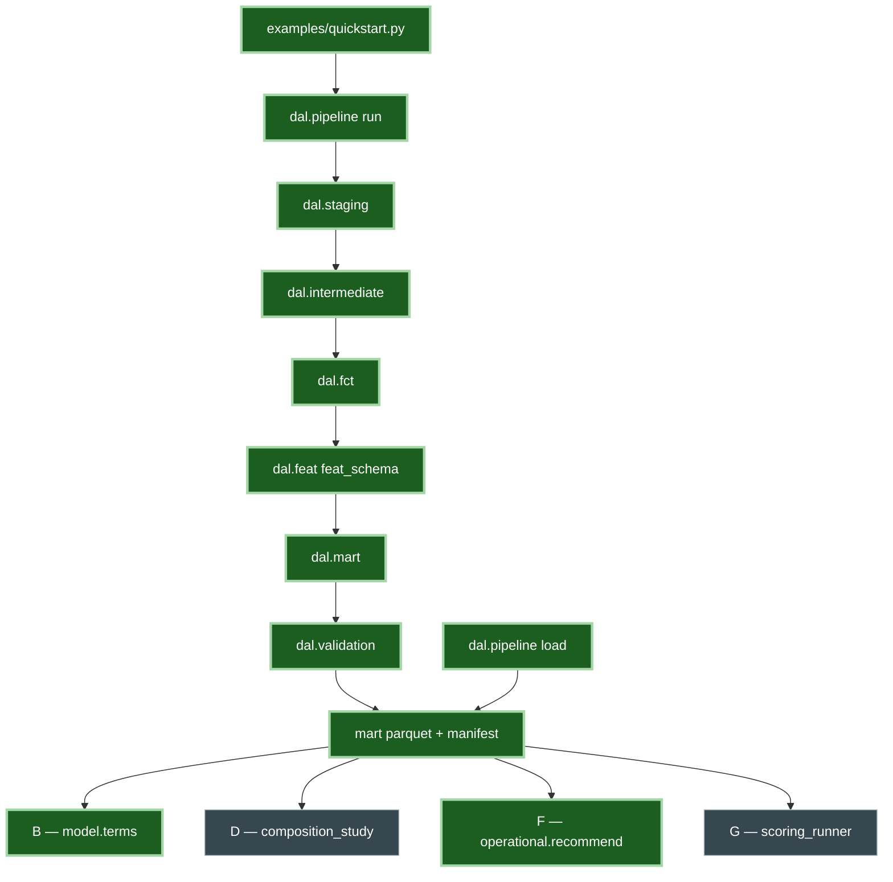

| Node | Note |
|---|---|
| `dal.mart` | Shared with G — `serve.scoring.engine` imports `POSITION_CODE_MAP` from it |
| mart artifact | Shared by all four consumers; belongs to no single workflow |

### B — Predictive research program

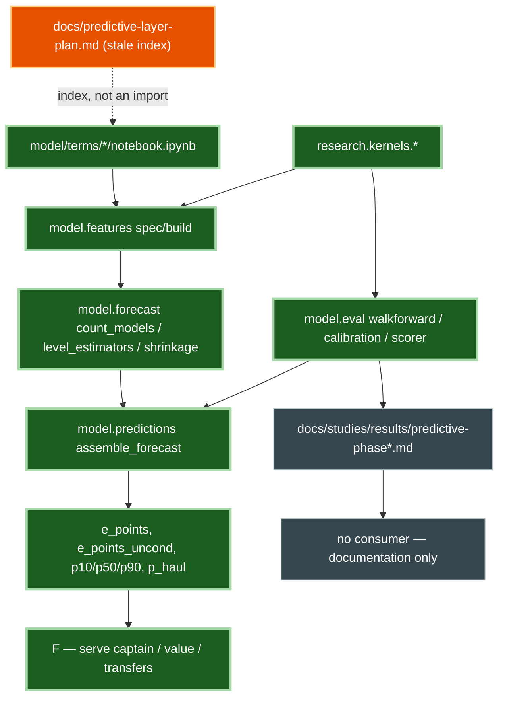

| Node | Note |
|---|---|
| `research.kernels.*` | Shared with F — `kernels.inferential.resampling` reused per ADR-012 Amendment |
| `docs/predictive-layer-plan.md` | Dotted: an index doc, not a code edge; stale per map §3 divergence 5 |
| phase result docs | Terminal by design — evidence trail, no programmatic reader |

### C — Captaincy audit (in flight, uncommitted)

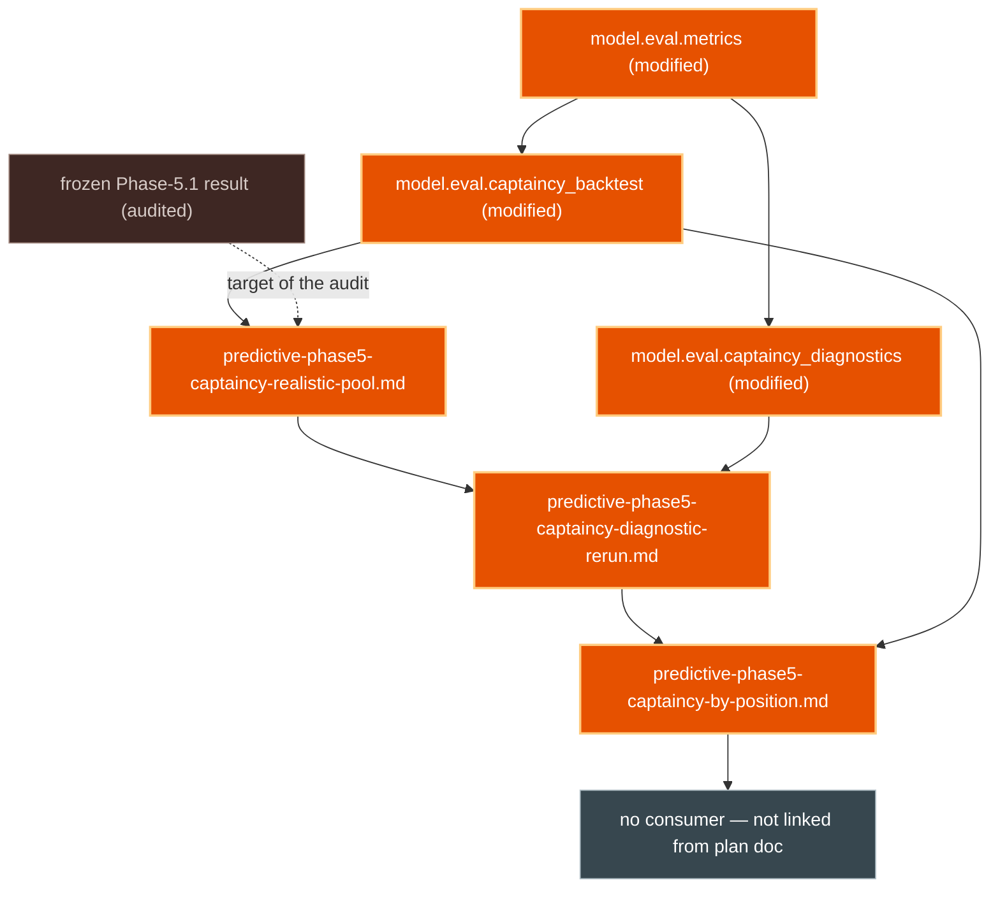

| Node | Note |
|---|---|
| all three `.py` | Uncommitted working-tree modifications; shared location with B's `model/eval/` |
| frozen Phase-5.1 | Docs note frozen numbers no longer reproduce against current code |
| `model.eval.metrics` | Adds `BLOCK_GWS`, `block_bootstrap_draws` |

### D — SYNTH-01 composites

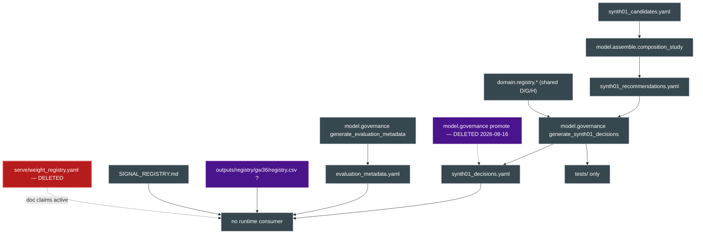

| Node | Note |
|---|---|
| `domain.registry.*` | Shared with G and H |
| `promotion` / `semantics` | §5 UNVERIFIED — membership inferred from a `synth01_decisions.yaml` grep, not traced per module. `promote.py` was deleted 2026-08-16 (no importer, no consumer for its `outputs/registry/` artifact); `verdict_records.py`, `generate_synth01_decisions.py`, `generate_evaluation_metadata.py`, `evaluation_metadata.yaml` and `SIGNAL_REGISTRY.md` were **deleted at `ae90398`** |
| `outputs/registry/gw36/` | **Deleted at `ae90398`** — confirmed to have no reader |
| `serve/weight_registry.yaml` | Deleted at `89a7b35`; no longer referenced from `docs/navigation-map.md` |

### E — Phase-9 monitor (archived)

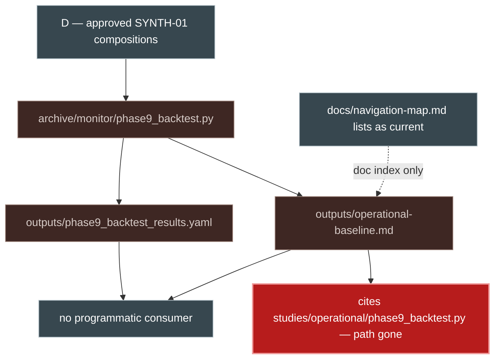

| Node | Note |
|---|---|
| stale path | `studies/` did not survive the `research/` migration; real file is `archive/monitor/phase9_backtest.py` |

### F — Decision-as-contract runtime (the live path)

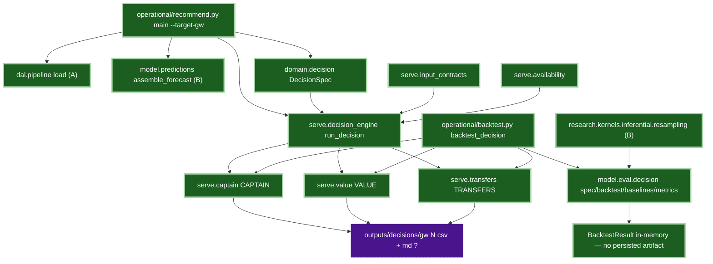

| Node | Note |
|---|---|
| `dal.pipeline load`, `assemble_forecast` | Shared with A and B respectively |
| `research.kernels.inferential.resampling` | Shared with B |
| `outputs/decisions/gw N` | §5 UNVERIFIED — directory absent, `outputs/*` gitignored; no evidence the runner has produced persisted output |
| `serve.captain/value/transfers` | Shared with the backtest path — same `rank_*` functions injected as `pick_fn` |

### G — Composite scoring CLI — **REMOVED at `ae90398`** (historical diagram)

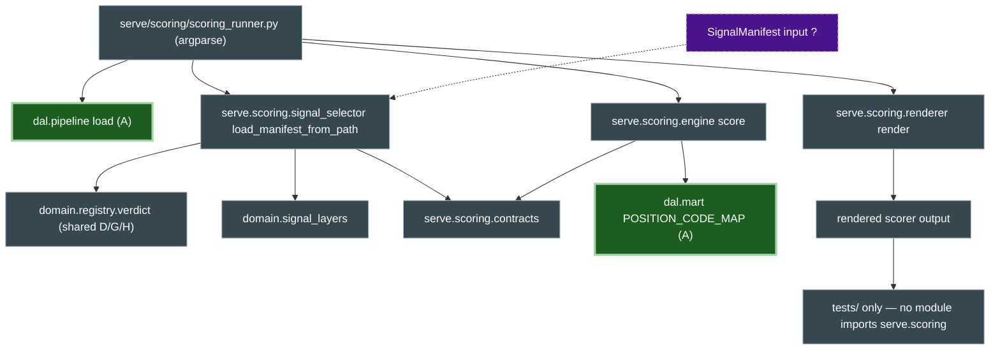

| Node | Note |
|---|---|
| `dal.pipeline load`, `dal.mart` | Shared with A |
| `domain.registry.verdict` | Shared with D and H |
| SignalManifest input | Moot — the whole package and its tests were deleted at `ae90398` |
| consumers | Were `tests/test_scorer_engine.py`, `test_registry_lifecycle.py`, `test_runtime_metadata_propagation.py` — all deleted at `ae90398` |

### H — Weekly report CLI — **REMOVED at `ae90398`** (historical diagram)

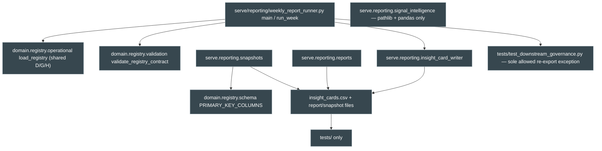

| Node | Note |
|---|---|
| `domain.registry.*` | Shared with D and G |
| `signal_intelligence` | Drawn unconnected — imports only `pathlib` and `pandas`; despite the name, no edge to retired signal machinery |
| no DAL edge | This workflow reads the registry, never `dal.pipeline` |

---

## 3. Fork-point timeline

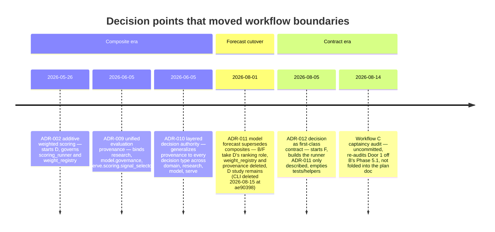

| Date | ADR / event | Started | Displaced |
|---|---|---|---|
| 2026-05-26 | ADR-002 | D — composite scoring, `weight_registry.yaml` locked | — (both retired: `89a7b35`, `ae90398`) |
| 2026-06-05 | ADR-009 | Shared provenance across research / governance / `serve.scoring` | Ad-hoc per-study provenance |
| 2026-06-05 | ADR-010 | `domain.registry` spine for D/G/H | Implicit single-slot "one true source per decision" |
| 2026-08-01 | ADR-011 (`06aa438`) | B's forecast feeding serve rankers | D's ranking role; `weight_registry.{yaml,py}` + `provenance.py` deleted; D's study left in place, its governance chain and `serve/scoring` CLI deleted at `ae90398` |
| 2026-08-05 | ADR-012 (`c475873`) | F — `DecisionSpec`, `serve.decision_engine`, `model/eval/decision/` | The runner ADR-011 referred to but never built; `tests/helpers/*` emptied to `__init__.py` |
| 2026-08-14 | Workflow C | Captaincy pool re-audit, three result docs | Nothing — diverges from B's stated "Door 2" resume pointer without replacing it |

ADR dates are the `Date:` field in each ADR; commit hashes are the commit that introduced or
superseded the file (`git log -1` per path). ADR-002's file is dated 2026-08-01 in git because
`06aa438` rewrote its header to record supersession.
